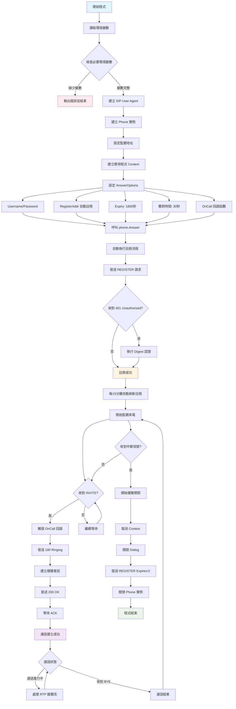

# sipgox

is experimental/extra area to add more functionality on top [sipgo lib](https://github.com/emiago/sipgo),

To find out more check [GO Documentation](https://pkg.go.dev/github.com/emiago/sipgox)

To find out more, read also article about [E2E testing](https://github.com/emiago/sipgo/wiki/E2E-testing) and check [GO Documentation](https://pkg.go.dev/github.com/emiago/sipgox)


## 程式流程圖

以下是 SIP 客戶端程式的完整執行流程：



### 流程說明

1. **初始化階段** (藍色)：程式啟動，檢查環境變數和建立必要物件
2. **註冊階段** (橙色)：自動向 SIP 伺服器註冊，每15分鐘刷新一次
3. **監聽階段**：等待來電並處理 INVITE 請求
4. **通話階段** (紫色)：建立通話、處理媒體流、維持通話狀態
5. **關閉階段** (綠色)：優雅關閉所有連線和資源

## SIP 握手流程圖

以下是標準的SIP握手流程，展示從註冊到通話建立再到結束的完整過程：

```mermaid
sequenceDiagram
    participant UAC as SIP客戶端<br/>(UAC)
    participant Proxy as SIP代理伺服器<br/>(Proxy/Registrar)
    participant UAS as SIP伺服器<br/>(UAS)
    
    Note over UAC,UAS: SIP註冊階段
    UAC->>Proxy: 1. REGISTER sip:domain.com
    Proxy-->>UAC: 2. 401 Unauthorized (需要驗證)
    UAC->>Proxy: 3. REGISTER (含認證資訊)
    Proxy-->>UAC: 4. 200 OK (註冊成功)
    
    Note over UAC,UAS: SIP通話建立階段
    UAC->>Proxy: 5. INVITE sip:bob@domain.com
    Proxy->>UAS: 6. INVITE sip:bob@domain.com
    UAS-->>Proxy: 7. 100 Trying
    Proxy-->>UAC: 8. 100 Trying
    UAS-->>Proxy: 9. 180 Ringing
    Proxy-->>UAC: 10. 180 Ringing
    UAS-->>Proxy: 11. 200 OK (SDP)
    Proxy-->>UAC: 12. 200 OK (SDP)
    UAC->>Proxy: 13. ACK
    Proxy->>UAS: 14. ACK
    
    Note over UAC,UAS: RTP媒體流階段
    UAC<->>UAS: 15. RTP/RTCP 媒體流
    
    Note over UAC,UAS: 通話結束階段
    UAC->>Proxy: 16. BYE
    Proxy->>UAS: 17. BYE
    UAS-->>Proxy: 18. 200 OK
    Proxy-->>UAC: 19. 200 OK
```

### 流程說明

1. **註冊階段 (1-4)**：客戶端向SIP伺服器註冊，建立身份認證
2. **通話建立階段 (5-14)**：發起通話邀請，經過響鈴到接聽確認
3. **媒體流階段 (15)**：建立RTP/RTCP媒體流進行語音/視訊通訊
4. **結束階段 (16-19)**：任一方發起BYE請求結束通話

> **重要提醒**：在本專案的調整中，當驗證成功後，系統將自動處理Expiry參數，無需手動設定註冊過期時間。

---

If you find it useful, support [sipgo lib](https://github.com/emiago/sipgo), open issue etc...

Checkout [echome](/echome/) example to see more. 

## Phone (Deprecated, use diago)

Features:
- [x] Simple API for UA/phone build with dial answer register actions
- [x] Minimal SDP package for audio
- [x] RTP/RTCP receiving and logging
- [x] Extendable MediaSession handling for RTP/RTCP handling (ex microphone,speaker)
- [x] Hangup control on caller
- [x] Timeouts handling
- [x] Digest auth
- [x] Transfers on phone answer, dial

Phone is wrapper that allows you to build phone in couple of lines. 
Then you can quickly create/receive SIP call, handle RTP/RTCP, etc... 
It uses `sipgo.Dialog` and `media` package.

*NOTE*: It has specific design for testing, and it can not be used for full softphone build.

### Dialer

```go
ua, _ := sipgo.NewUA()
defer ua.Close()

// Create a phone
phone := sipgox.NewPhone(ua) 

// Run dial
ctx, _ := context.WithTimeout(context.Background(), 60*time.Second)

// Blocks until call is answered
dialog, err := phone.Dial(ctx, sip.Uri{User:"bob", Host: "localhost", Port:5060}, sipgox.DialOptions{})
if err != nil {
    // handle error
    return
}
defer dialog.Close() // Close dialog for cleanup

select {
case <-dialog.Done():
    return
case <-time.After(5 *time.Second):
    dialog.Hangup(context.TODO())
}
```

### Receiver

```go
ctx, _ := context.WithCancel(context.Background())

ua, _ := sipgo.NewUA()
defer ua.Close()

// Create a phone
phone := sipgox.NewPhone(ua)

// Blocks until call is answered
dialog, err := phone.Answer(ctx, sipgox.AnswerOptions{
    Ringtime:  5* time.Second,
})
if err != nil {
    //handle error
    return
}
defer dialog.Close() // Close dialog for cleanup

select {
case <-dialog.Done():
    return
case <-time.After(10 *time.Second):
    dialog.Hangup(context.TODO())
}
```

### Reading/Writing RTP/RTCP on dialog

After you Answer or Dial on phone, you receive dialog.

**RTP**
```go
buf := make([]byte, media.RTPBufSize) // Has MTU size
pkt := rtp.Packet{}
err := dialog.ReadRTP(buf, &pkt)

err := dialog.WriteRTP(pkt)

```

similar is for RTCP

## SIP 封包監控指令

### 安裝必要工具

```bash
sudo apt-get install tcpdump tshark wireshark
```

### 基本 SIP 封包監控

#### 使用 tcpdump 監控 SIP 封包

```bash
# 監控所有 SIP 封包 (UDP 5060)
sudo tcpdump -i any -n port 5060

# 監控特定介面的 SIP 封包
sudo tcpdump -i eth0 -n port 5060

# 監控 SIP 封包並顯示詳細內容
sudo tcpdump -i any -n -A port 5060

# 監控特定 SIP 伺服器的封包
sudo tcpdump -i any -n host 192.168.1.210 and port 5060
sudo tcpdump -i any -n host 192.168.11.185 and port 6060

# 將封包保存到檔案
sudo tcpdump -i any -n -w sip_capture.pcap port 5060

# 監控多個端口 (SIP 可能使用不同端口)
sudo tcpdump -i any -n port 5060 or port 5061 or port 5062
```

#### 使用 tshark 分析 SIP 封包

```bash
# 即時分析 SIP 封包
sudo tshark -i any -f "port 5060" -Y sip

# 只顯示 SIP 方法 (REGISTER, INVITE, etc.)
sudo tshark -i any -f "port 5060" -Y sip -T fields -e sip.Method -e sip.r-uri -e sip.from.user -e sip.to.user

# 分析已保存的封包檔案
tshark -r sip_capture.pcap -Y sip

# 顯示 SIP 對話流程
tshark -r sip_capture.pcapng -Y sip -T fields -e frame.time -e sip.Method -e sip.Status-Code -e sip.r-uri

# 過濾特定 SIP 方法
sudo tshark -i any -f "port 5060" -Y "sip.Method == REGISTER"
sudo tshark -i any -f "port 5060" -Y "sip.Method == INVITE"
sudo tshark -i any -f "port 5060" -Y "sip.Method == BYE"
```

#### 進階監控指令

```bash
# 監控 SIP 和 RTP 封包 (常見 RTP 端口範圍)
sudo tcpdump -i any -n port 5060 or portrange 10000-20000

# 使用 ngrep 搜尋 SIP 內容
sudo ngrep -i -q -P " " -W byline "REGISTER\|INVITE\|BYE" port 5060

# 監控特定使用者的 SIP 封包
sudo tshark -i any -f "port 5060" -Y 'sip.from.user == "your_username" or sip.to.user == "your_username"'

# 即時顯示 SIP 註冊狀態
sudo tshark -i any -f "port 5060" -Y "sip.Method == REGISTER or sip.Status-Code" -T fields -e sip.Method -e sip.Status-Code -e sip.from.user
```

### 實用的監控腳本

建立一個監控腳本 `monitor_sip.sh`：

```bash
#!/bin/bash
# SIP 封包監控腳本

SIP_SERVER=${1:-"any"}  # SIP 伺服器 IP，預設監控所有
INTERFACE=${2:-"any"}   # 網路介面，預設所有介面
PORT=${3:-"5060"}       # SIP 端口，預設 5060

echo "開始監控 SIP 封包..."
echo "伺服器: $SIP_SERVER"
echo "介面: $INTERFACE" 
echo "端口: $PORT"
echo "按 Ctrl+C 停止監控"
echo "=========================="

if [ "$SIP_SERVER" = "any" ]; then
    sudo tcpdump -i $INTERFACE -n -A port $PORT
else
    sudo tcpdump -i $INTERFACE -n -A host $SIP_SERVER and port $PORT
fi
```

使用方式：
```bash
chmod +x monitor_sip.sh
./monitor_sip.sh                          # 監控所有 SIP 封包
./monitor_sip.sh 192.168.1.100           # 監控特定伺服器
./monitor_sip.sh 192.168.1.100 eth0      # 監控特定伺服器和介面
./monitor_sip.sh 192.168.1.100 eth0 5061 # 監控特定伺服器、介面和端口
```

### 封包分析技巧

1. **查看 SIP 註冊流程**：
   ```bash
   sudo tshark -i any -f "port 5060" -Y "sip.Method == REGISTER or (sip.Status-Code >= 200 and sip.Status-Code < 300) or sip.Status-Code == 401"
   ```

2. **監控通話建立**：
   ```bash
   sudo tshark -i any -f "port 5060" -Y "sip.Method == INVITE or sip.Method == ACK or sip.Status-Code == 180 or sip.Status-Code == 200"
   ```

3. **檢查認證問題**：
   ```bash
   sudo tshark -i any -f "port 5060" -Y "sip.Status-Code == 401 or sip.Status-Code == 403 or sip.Status-Code == 407"
   ```

> **提示**：使用 Wireshark GUI 工具可以更直觀地分析 SIP 封包流程，特別適合調試複雜的 SIP 對話。